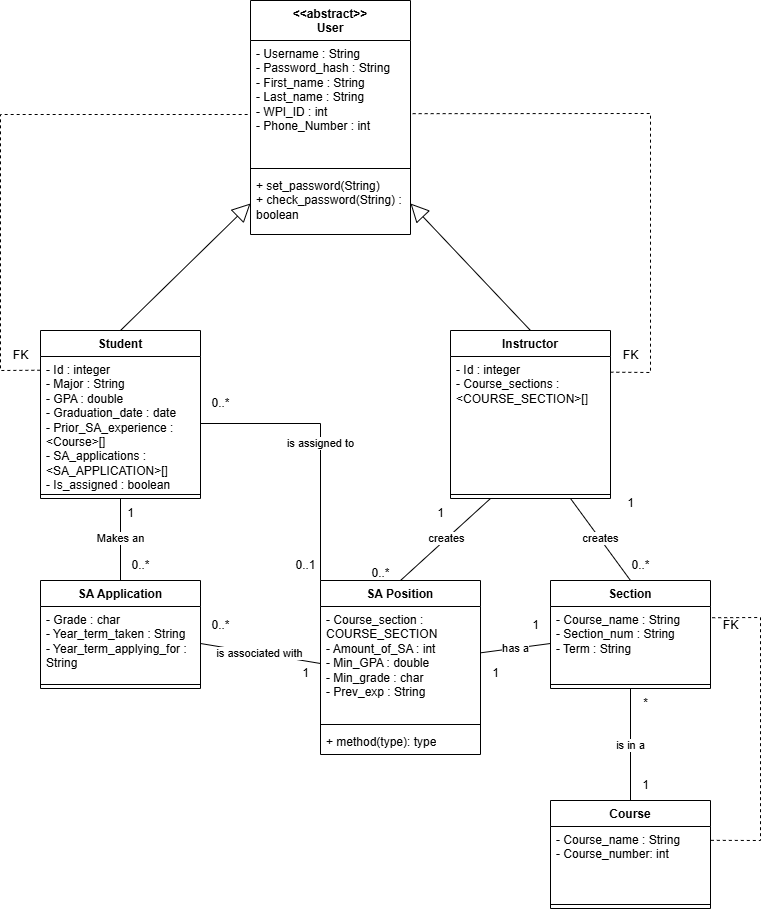

# Project Design Document

## SA Recruitment Web App
--------
Prepared by:

* `Jonathan Tinti`,`WPI`
* `Alan Wang`,`WPI`
* `Oliver Reera`,`WPI`
* `Chris Smith`,`WPI`
---

**Course** : CS 3733 - Software Engineering 

**Instructor**: Sakire Arslan Ay

---

## Table of Contents
- [1. Introduction](#1-introduction)
- [2. Software Design](#2-software-design)
    - [2.1 Database Model](#21-model)
    - [2.2 Subsystems and Interfaces](#22-subsystems-and-interfaces)
    - [2.2.1 Overview](#221-overview)
    - [2.2.2 Interfaces](#222-interfaces)
    - [2.3 User Interface Design](#23-user-interface-design)
- [3. References](#3-references)

### Document Revision History

| Name | Date | Changes | Version |
| ------ | ------ | --------- | --------- |
|Revision 1 |2024-11-15 |Initial draft | 1.0        |
|      |      |         |         |

# 1. Introduction

The purpose of this document is to create a skeleton for the project so we know what basic templates and database tables to have in the project. We establish all of the relations for different tables in this document so when we begin to code, we already understand how the different classes interact. This will create a more efficient system when we begin to start coding. This is what our final product plan is, so it is an example for what our final product should look like so we can work to create a similar product. 

# 2. Software Design
This section describes how our final software product will operate and how the user will interact with it.

### UML Component Diagram
<kbd>
    
</kbd>

## 2.1 Database Model

1. User: abstract class that stores the common information for instructor and student.
2. Student: stores information for each system such as GPA, experience, and graduation date.
3. Instructor: stores information for each instructor such as the course sections they are teaching to allow for them to create SA positions
4. Course: stores information on each course offered in the CS department such course number and name.
5. Course section: stores information for a specific course such as when the course is offered and the section name
6. SA Position: stores information for the position the instructor created which specifies requirements such as minimum GPA and the number of SA positons available
7. SA Application: stores information for the application a Student submitted such as their grade in the class and year they took the class. 

### Database UML Diagram
<kbd>
    
</kbd>

## 2.2 Subsystems and Interfaces

### 2.2.1 Overview

4. 
Our software will be composed of three major subsystems: main, auth, and errors. The errors subsystem will only be used for handling errors in routing and requests. The auth subsystem will handle all authorization tasks such as registering a new user, logging in and out, and keeping the forms for each of those. Most everything that will not be handled by the errors and auth subsystems will be handled by the main subsystem including courses, positions, applications, etc.

### 2.2.2 Interfaces

#### 2.2.2.1 \<Auth> Routes

| Route                     | Methods  | URL Path            | Description                                     |
|:--------------------------|:---------|:--------------------|:------------------------------------------------|
|1. student_registration    |GET, POST |/student/register    |Create a student account based on user input     |
|2. instructor_registration |GET, POST |/instructor/register |Create an instructor account based on user input |
|3. login                   |GET, POST |/login               |Handle login queries based on user input         |
|4. logout                  |GET       |/logout              |Logs the current user out of the application     |

#### 2.2.2.2 \<Main> Routes

| Route                   | Methods  | URL Path                    | Description                                                       |
|:------------------------|:---------|:----------------------------|:------------------------------------------------------------------|
|1. create_position       |GET, POST |/position/create             |Create a new SA position available for a course section            |
|2. create_course_section |GET, POST |/course/create               |Create a new course section                                        |
|3. view_sa_positions     |GET       |/view/positions              |Allows students see available SA positions                         |
|4. view_sa_applications  |GET       |/view/\<section>/applications|Allows instructors to see SA applications for their course sections|
|5. view_sent_applications|GET       |/view/\<user>/applications   |Allows students to see their own, sent applications                |
|6. create_application    |GET, POST |/application/create          |Create an application for a course section based on user input     |
|7. withdraw_application  |POST      |/application/withdraw        |Withdraws a sent application                                       |
|8. edit_student          |GET, POST |/student/edit                |Edit a student account based on user input                         |
|9. edit_instructor       |GET, POST |/instructor/edit             |Edit an instructor account based on user input                     |

### 2.3 User Interface Design 
1. login.html
<kbd>
    
</kbd>

2. register_instructor.html

<kbd>
    
</kbd>

3. register_student.html

<kbd>
    
</kbd>

4. _create_position.html

<kbd>
    
</kbd>

5. _create_section.html

<kbd>
    
</kbd>

6. edit_instrcutorprofile.html

<kbd>
    
</kbd>

7. edit_studentprofile.html

<kbd>
    
</kbd>

8. _apply.html

<kbd>
    
</kbd>

9. view_application.html

<kbd>
    
</kbd>

10. index.html

<kbd>
    
</kbd>

# 3. References
Shamsuddeen, Z. (2020, January 6). REST API best practise for routes [Forum post]. Stack Overflow. https://stackoverflow.com/q/59608660

